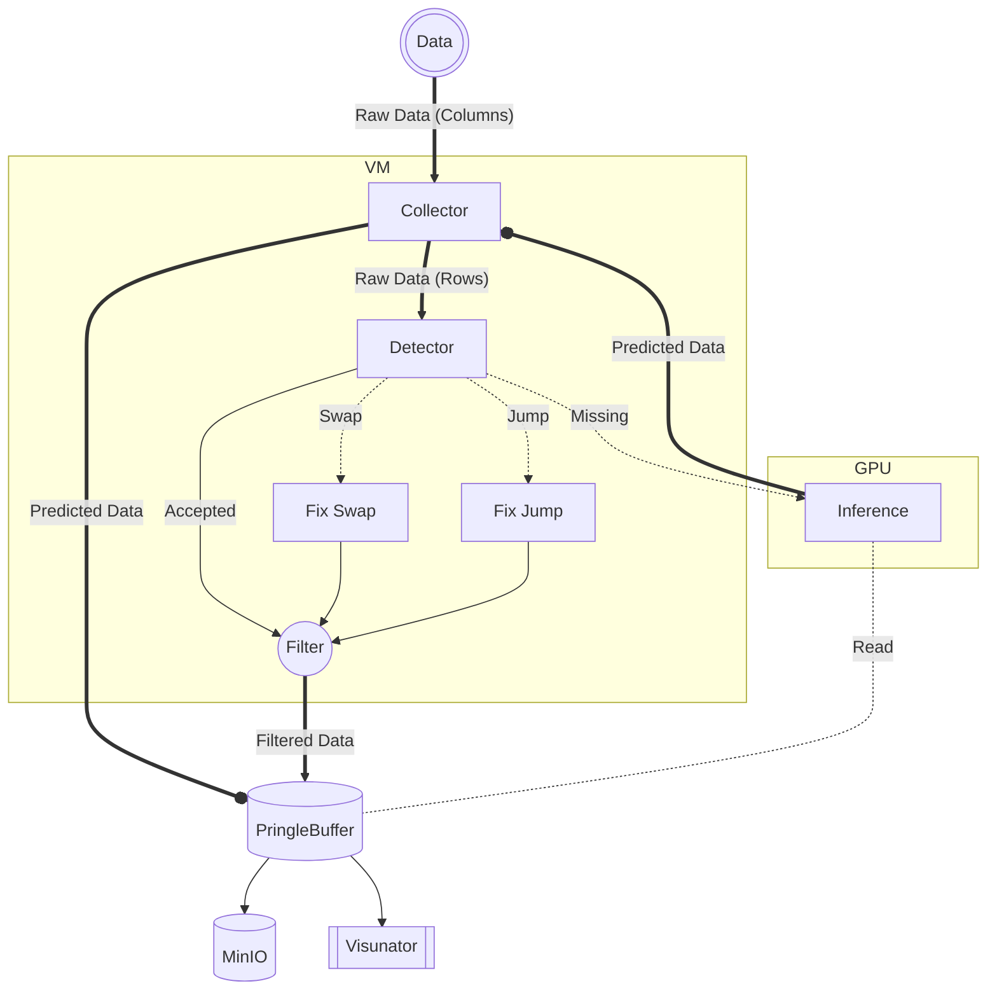

# DookieFilter

```mermaid
graph TD;
    DataStream((("Data")));
    PB[(PringleBuffer)];
    MinIO[(MinIO)];
    Visunator[[Visunator]]

    DataStream ==>|Raw Data #40;Columns#41;|Collector;
    PB -->MinIO & Visunator;

    subgraph VM
    Collector["Collector"];
    Detector["Detector"];
    FixSwap["Fix Swap"];
    FixJump["Fix Jump"];
    Filter(("Filter"));

    Collector ==>|Raw Data #40;Rows#41;|Detector;
    Detector -.->|Swap| FixSwap;
    Detector -.->|Jump| FixJump;
    Detector -->|Accepted|Filter;
    FixSwap & FixJump -->Filter;
    end
    Collector ==o|Predicted Data|PB;
    Filter ==>|Filtered Data|PB;

    Detector -.->|Missing|AIInterference;
    AIInterference -.-|Read|PB;

    subgraph GPU
    AIInterference["Inference"];
    end

    AIInterference ==o|Predicted Data|Collector;
```
