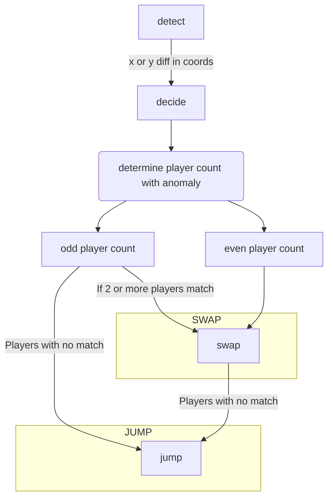

```mermaid
graph TD;
dt["detect"];

    dc["decide"];

    dt -->|x or y diff in coords| dc;


    p("determine player count with anomaly");
    dc --> p;
    o["odd player count"]
    e["even player count"]
    p --> e & o;

    o -->|Players with no match| jump;
    o -->|If 2 or more players match| swap;
    e --> swap;


    subgraph SWAP;
    swap;
    end;
    swap -->|Players with no match| jump;


    subgraph JUMP;
    jump;
    end;
```
