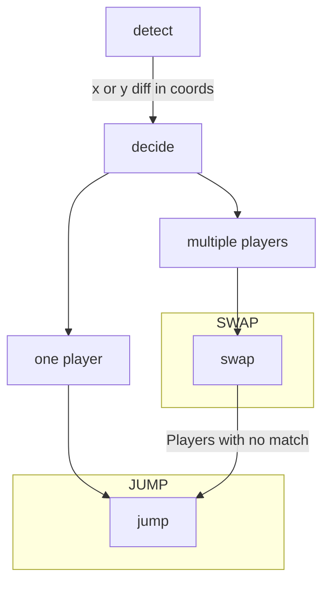

```mermaid
graph TD;
dt["detect"];

    dc["decide"];

    dt -->|x or y diff in coords| dc;

    o["one player"]
    e["multiple players"]
    dc --> o & e;

    o --> jump;
    e --> swap;


    subgraph SWAP;
    swap;
    end;
    swap -->|Players with no match| jump;


    subgraph JUMP;
    jump;
    end;
```
